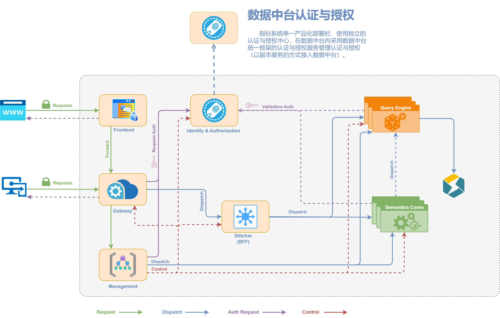

# bdt-query-engine

指标系统-查询引擎，一个基于Java开发的高性能指标查询服务。

** query engine仅用于查询数据。 **

## 项目简介

本项目是一个专门用于处理和查询指标数据的服务引擎，提供高效的数据查询和处理能力。基于Spring Boot开发，采用模块化设计，支持灵活的指标查询和数据处理功能。

## 整体架构图



## 项目结构

```
├── query-engine-api    # API接口模块
├── query-engine-impl   # 具体实现模块
├── docker-deps        # Docker相关依赖和配置
└── docs              # 项目文档
```

## 技术栈

- JDK 1.8
- Spring Boot
- MySQL 8.0
- Redis 3.2
- Docker & Docker Compose

## 环境要求

- Docker >= 20.10.16
- Docker Compose >= 2.6.0
- Maven 3.5.2（用于编译，已在Docker中配置）

## 部署说明

***开发环境基于docker搭建，支持以下系统：***
- Mac/Linux/Unix（使用.sh脚本）
- Windows（使用相应的.bat文件）

***注意：***
- Mac/WSL环境可使用普通用户执行
- Linux/Unix环境需要root用户或admin组权限

### 部署步骤

1. **构建基础镜像**
   ```shell
   cd ./docker-deps
   sh ./buildM3BaseImage.sh
   ```

2. **创建Docker网络**
   ```shell
   docker network create --driver=bridge --subnet=192.168.10.0/24 --ip-range=192.168.10.0/24 --gateway=192.168.10.1 devnws
   ```

3. **启动依赖服务**
   ```shell
   cd ./docker-deps
   docker compose up
   ```
   注意：如果环境中已有其他项目启动的MySQL，需要手动创建数据库和配置访问权限

4. **构建并运行应用**
   ```shell
   sh ./docker-redeploy-java.sh
   ```

### 服务信息

部署完成后，将有以下容器运行：
- bdt-query-engine: 主应用服务
  - 服务端口：9100
  - 调试端口：9101
  - 日志目录：/tmp/logs/bdt-query-engine
- MySQL: 数据存储服务
  - 端口：9918
- Redis: 缓存服务
  - 端口：6379

## 使用说明

服务启动后，可通过以下方式访问：

1. API接口：http://localhost:9100
2. 调试端口：9101

